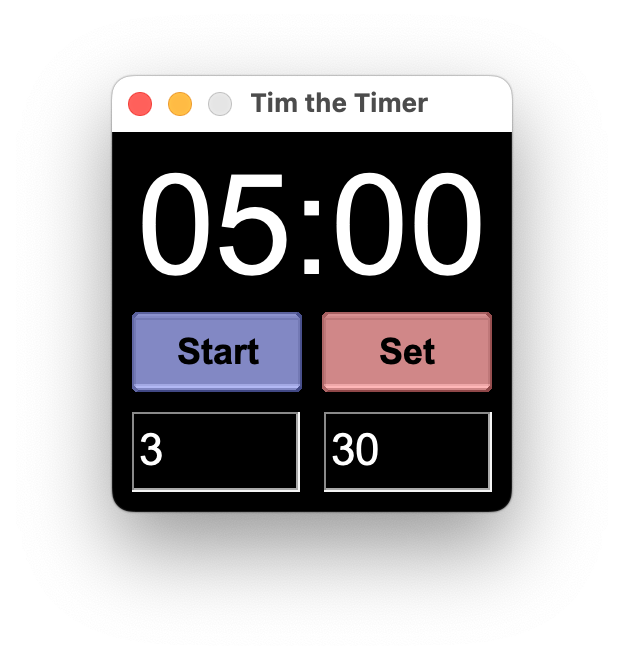

# Tim the Timer

Countdown timer written in Rust with the fltk-rs library.
Mainly developed for Mac but should also work on other operating systems.

## Features

- Changes background color when the countdown reaches one minute, then again when it reaches ten seconds.
- Use the default alarm sound or place a file named alarm.mp3 in the /assets folder for your own alarm sound.
- Set the timer using keyboard controls:
    - Up/Down arrow keys: Increase/decrease minutes by one
    - Ctrl + Up/Down arrow keys: Increase/decrease minutes by five
    - Shift + Up/Down arrow keys: Increase/decrease seconds by one
    - Ctrl + Shift + Up/Down arrow keys: Increase/decrease seconds by five
    - Enter: Start/pause countdown
- Set the timer with the mouse by hovering the cursor over the minutes or seconds display and scroll up or down
- Show the countdown in the status bar (Mac only)

## Running the releases

Since the release .app bundles are unsigned macOS will warn that the app is damaged when opened.

To remedy this, run the terminal command below:

```
xattr -d com.apple.quarantine Tim.app
```

## Screenshots





