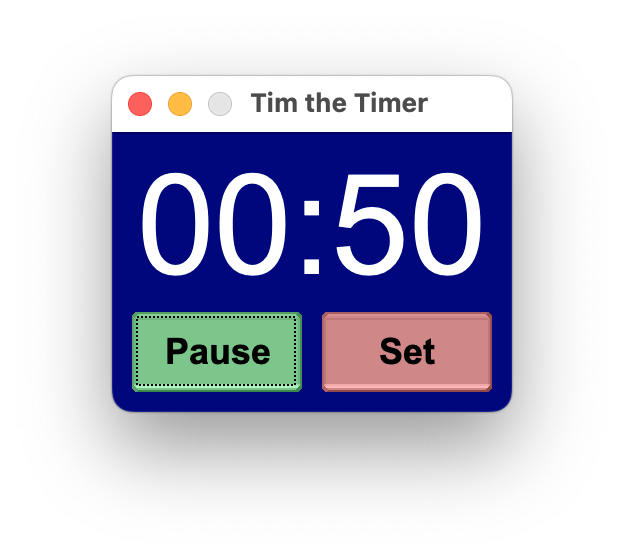

# Tim the Timer

Countdown timer written in Rust with the fltk-rs library.
Mainly developed for Mac but should also work on other operating systems.

To use your own alarm sound place a file name alarm.mp3 in the /assets folder.

## Running the releases

Since the release .app bundles are unsigned macOS will warn that the app is damaged when opened.

To remedy this, run the terminal command below:

```
xattr -d com.apple.quarantine Tim.app
```

## Screenshots





